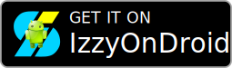
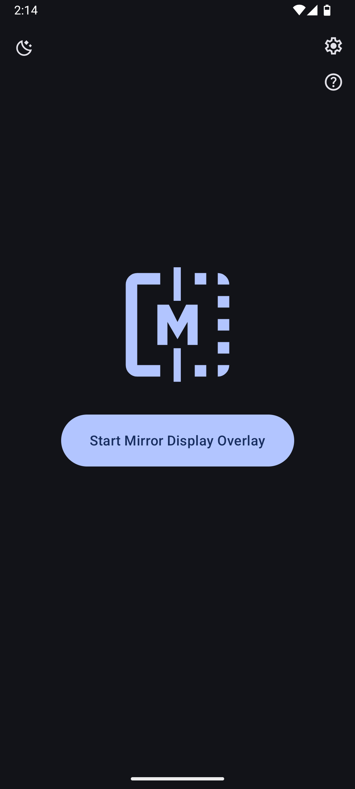
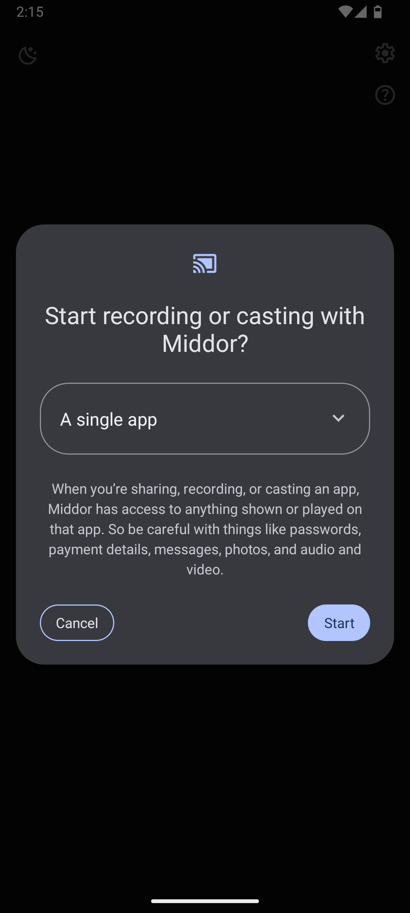
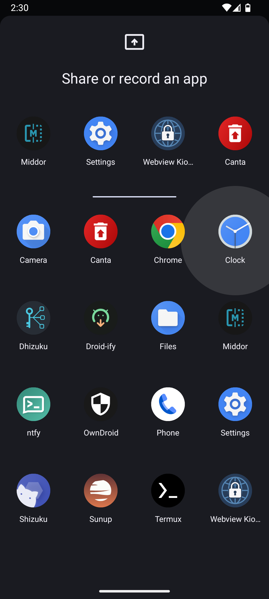
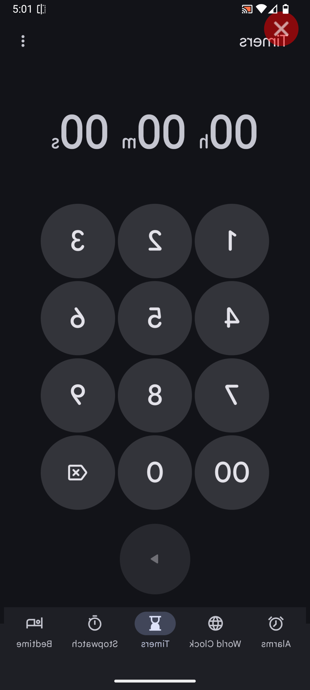
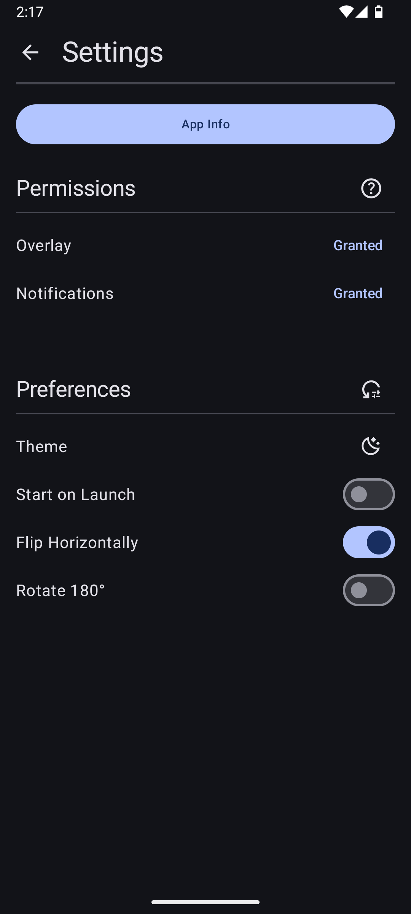
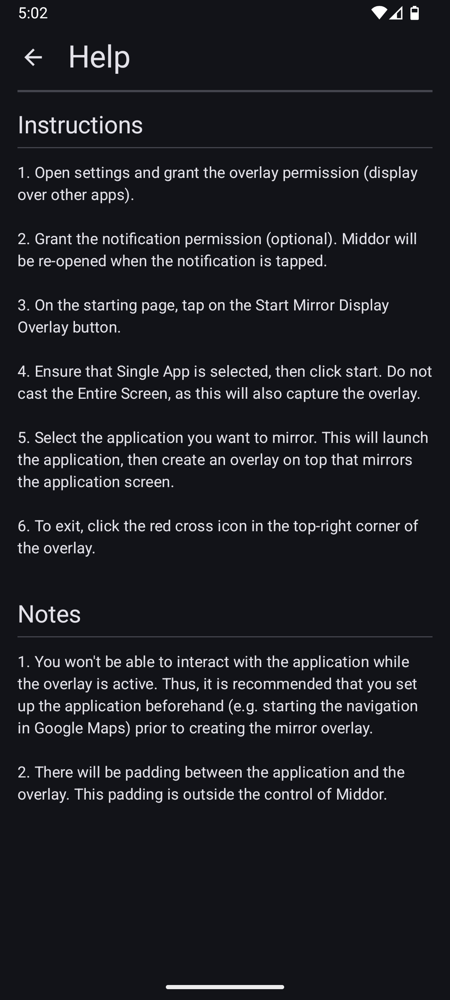

# Middor

Middor is a free and open-source Android application for mirroring apps on your device.

With built-in support for horizontal flip and 180° rotation, Middor can be used to:

- Display apps on a HUD
- Project content onto a car windscreen (e.g. Google Maps navigation)
- View mirrored images and videos

Middor only supports devices running Android 14 or higher (SDK 34+), as it
relies on the single app screen sharing feature. For more details, see
[Android 14 - App Screen Sharing](https://developer.android.com/about/versions/14/features/app-screen-sharing).

For usage instructions, see [Discussion #2](https://github.com/nktnet1/middor/discussions/2).

## Permissions

- <b>SYSTEM_ALERT_WINDOW</b>: to draw a mirror overlay on top of other apps
- <b>FOREGROUND_SERVICE</b>: to run the mirror service continuously while the overlay is active
- <b>FOREGROUND_SERVICE_MEDIA_PROJECTION</b>: for capturing the screen content of the underlying app
- <b>POST_NOTIFICATIONS</b>: (optional) to display the mirror service notification with additional actions

## Contact

- support@middor.nktnet.org

## License

This project is licensed under the GNU Affero General Public License v3.0 or later.

See the [LICENSE](./LICENSE) file for details.

## Screenshots

  &nbsp;
  &nbsp;
  &nbsp;
  &nbsp;
  &nbsp;
  

